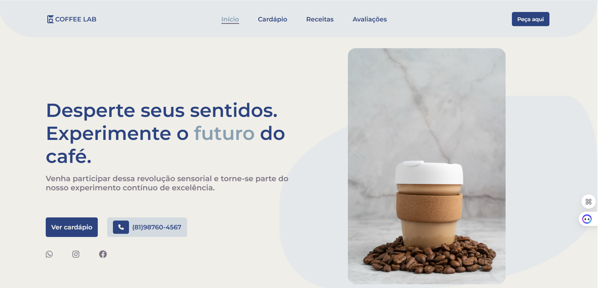
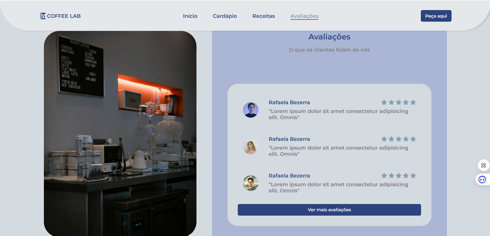

# Coffee Lab - Website para Cafeteria
Projeto front-end de uma cafeteria fictícia desenvolvido com HTML, CSS e JavaScript, focando em boas práticas e responsividade.

<br>

<div style="display: flex; gap: 1px;">
  
  
</div>

## Funcionalidades Principais

- **Navegação responsiva** com menu mobile
- **Seções animadas** com ScrollReveal
- **Cardápio interativo** com avaliações
- **Design system** com variáveis CSS
- **Layout totalmente responsivo**

## Destaques Técnicos

-**Arquitetura CSS Modular**
Organização em partials (header, home, menu, etc.) com variáveis CSS para consistência

-**Design Responsivo**
Media queries para mobile (600px) e tablet (1170px)
Menu mobile com toggle

-**Performance**
Import seletivo de Font Awesome
CDN para bibliotecas externas

## Tecnologias Utilizadas

| Tecnologia | Aplicação |
|------------|-----------|
| HTML5 | Estrutura semântica |
| CSS3 | Flexbox, Grid, Variáveis |
| JavaScript | Interações dinâmicas |
| jQuery | Manipulação do DOM |
| ScrollReveal | Animações no scroll |
| Font Awesome | Ícones vetoriais |
| Google Fonts | Tipografia |

## Estrutura de Arquivos

```
coffee-lab/
├── assets/
│   └── (imagens)
├── styles/
│   ├── avaliacoes.css
│   ├── footer.css
│   ├── header.css
│   ├── home.css
│   ├── menu.css
│   ├── receitas.css
│   └── style.css
├── index.html
├── script.js
└── README.md
```
## Melhorias Futuras

- Implementar carrinho de compras com LocalStorage
- Adicionar modo dark/light
- Integrar API de avaliações real
- Otimizar imagens para WebP

Desenvolvido por Josevan Tavares - [2024]
